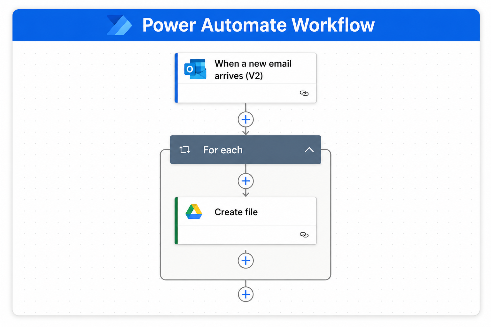

# 🚀 End-to-End Automated Hotel Data Pipeline with Incremental Load & Power BI

  

---

## 🛠️ Tech Stack

Python | Pandas | MySQL | GCP | Outlook | Power BI | Power Automate | Gateway | Streamlit

---

## 🧠 Project Overview

This project is a **fully automated data pipeline**.

👉 Data comes from emails
👉 Gets processed using Python
👉 Stored in MySQL
👉 Visualized in Power BI

Everything works automatically — no manual work needed.

---

# 🔄 Step 1: Power Automate Workflow (Data Ingestion)

  

### 💡 Simple Explanation

* When a new email arrives in Outlook
* Power Automate checks the subject
* If subject contains **`food_data24`**
* It takes the CSV file from email
* Saves it automatically into **Google Drive**

---

### 🧠 Logic Behind It

* **Trigger** → Email received
* **Condition** → Subject contains `food_data24`
* **Loop** → Goes through attachments
* **Action** → Upload file to Google Drive

👉 No manual download needed

---

# ⚙️ Step 2: ETL Pipeline (Python Processing)

  

## 📌 What is ETL?

* **Extract** → Get data
* **Transform** → Clean data
* **Load** → Store data

---

## 🔹 Extraction

* Fetch data from Google Drive
* Skip already processed files
* Combine all files

---

## 🔹 Cleaning

* Fix column names
* Remove duplicates
* Validate data
* Create `date_id`

---

## 🔹 Incremental Loading

* Check if data already exists
* Load only new data
* Skip duplicates

---

### 🧠 Why this matters

✔ Faster processing
✔ No duplicate data
✔ Efficient pipeline

---

# 🏗️ Step 3: Complete Architecture (End-to-End Flow)

  

---

## 🔄 Full Flow (Simple)

1. Email arrives
2. Power Automate saves file
3. Google Drive stores data
4. Python ETL processes data
5. MySQL stores data
6. Power BI shows insights
7. Streamlit monitors pipeline

---

## 📊 Final Summary

👉 Email → Drive → ETL → MySQL → Power BI

✔ Fully automated
✔ Incremental loading
✔ Scalable

---

## ⭐ Support

If you found this project useful, give it a ⭐ on GitHub!
