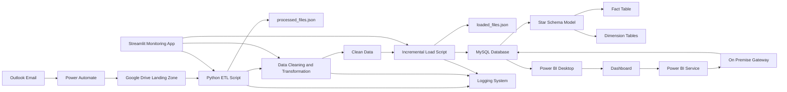

# 🚀 End-to-End Automated Hotel Data Pipeline with Incremental Load & Power BI

<p align="center">
  
</p>

---

## 🧠 Project Overview

This project demonstrates a fully automated **end-to-end data engineering pipeline** that ingests hotel data from emails, processes it using Python, and delivers actionable **business insights through interactive Power BI dashboards**.

The pipeline uses **incremental ingestion and incremental loading**, ensuring scalability, efficiency, and reduced redundant processing.

---

## ⚡ End-to-End Architecture



---

## 🏗️ Architecture Layers Explained

### 1️⃣ Data Source Layer

* Outlook emails from hotel managers
* Rule-based filtering for relevant files

### 2️⃣ Automation Layer

* Power Automate for email processing
* Automatic file transfer to cloud storage

### 3️⃣ Storage Layer

* Google Drive as landing zone
* Centralized raw data repository

### 4️⃣ Processing Layer

* Python ETL pipeline
* Data cleaning, validation, transformation

### 5️⃣ Incremental Logic Layer

* Tracks processed files using JSON
* Prevents duplicate ingestion
* Loads only new or updated records

### 6️⃣ Data Warehouse Layer

* MySQL database
* Star schema (Fact + Dimension tables)

### 7️⃣ Visualization Layer

* Power BI dashboards
* KPI tracking and trend analysis

### 8️⃣ Security Layer

* Row-Level Security (RLS)
* Controlled data access

---

## 🛠️ Tech Stack

<p align="center">

<!-- Core Stack -->


<!-- Microsoft Stack -->


<!-- Gateway (using generic network/server icon for clarity) -->


<!-- Other Tools -->


</p>

<p align="center">
Python | Pandas | MySQL | GCP | Outlook | Power BI | Power Automate | On-Prem Gateway | Streamlit | GitHub
</p>


---

## 📈 Pipeline Highlights

* Fully automated data pipeline
* Incremental ingestion and loading
* Reduced processing time
* Business-ready insights
* Secure data access
* Monitoring via Streamlit

---

## 🎯 Business Impact

* Eliminated manual data handling
* Improved data accuracy
* Faster reporting
* Scalable architecture

---

## 📂 Project Structure

```text
hotel-data-pipeline/
│
├── data/
├── scripts/
│   ├── etl_pipeline.py
│   ├── incremental_load.py
│
├── sql/
│   ├── create_tables.sql
│   ├── incremental_queries.sql
│
├── powerbi/
│   ├── dashboard.pbix
│
├── docs/
│   ├── architecture.png
│
├── app.py
├── main.py
├── processed_files.json
├── loaded_files.json
├── requirements.txt
└── README.md
```

---

## 🚀 How to Run

1. Clone the repository
2. Configure Google Drive API credentials (GCP Service Account)
3. Set up MySQL database
4. Run the ETL pipeline script
5. Execute the incremental load script
6. Open the Power BI dashboard

---

## ⭐ Support

If you found this project useful, give it a ⭐ on GitHub!
