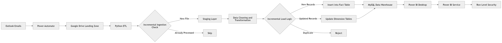

# 🚀 End-to-End Automated Hotel Data Pipeline with Incremental Load & Power BI

<p align="center">
  
</p>

---

## 🧠 Project Overview

A fully automated **data engineering pipeline** that ingests hotel data from emails, processes it using Python, and delivers insights through Power BI with **incremental ingestion and incremental loading**.

---

## ⚡ Detailed Architecture (Incremental Pipeline)

## ⚡ End-to-End Architecture (Incremental Pipeline)

<p align="center">
  <a href="mermaid-diagram.png">
    
  </a>
</p>

<p align="center">
  <em>Automated Data Flow with Incremental Ingestion & Incremental Load</em>
</p>

```mermaid
flowchart LR
    A[📩 Outlook Emails] -->|New File Trigger| B[⚙️ Power Automate]
    B -->|Rule-based Routing| C[📁 Google Drive (Landing Zone)]
    
    C -->|Fetch via API| D[🐍 Python ETL]
    
    D --> E{🧠 Incremental Ingestion Check}
    E -->|New File / New Records| F[📥 Staging Layer]
    E -->|Already Processed| X[⛔ Skip]
    
    F --> G[🧹 Data Cleaning & Transformation]
    
    G --> H{📊 Incremental Load Logic}
    H -->|New Records| I[➕ Insert into Fact Table]
    H -->|Updated Records| J[🔄 Update Dimension Tables]
    H -->|Duplicate| K[⛔ Reject]
    
    I --> L[🗄️ MySQL Data Warehouse]
    J --> L
    
    L --> M[📊 Power BI Desktop]
    M --> N[☁️ Power BI Service]
    
    N --> O[🔐 Row-Level Security (RLS)]
```

---

## 🔥 Incremental Logic (Core Highlight)

### 🧩 Incremental Ingestion

```python
# Check if file already processed
if file_id not in processed_files:
    process_file()
    processed_files.add(file_id)
else:
    skip_file()
```

### 🧩 Incremental Load

```python
# Load only new or updated records
if record_date > last_loaded_date:
    insert_into_fact_table()
elif record_exists:
    update_dimension_table()
else:
    skip_duplicate()
```

---

## 🏗️ Architecture Layers Explained

### 1️⃣ Data Source Layer

📩 Outlook Emails

* Managers send data files
* Trigger-based ingestion

---

### 2️⃣ Automation Layer

⚙️ Power Automate

* Filters emails using rules
* Moves attachments to Google Drive

---

### 3️⃣ Storage Layer

☁️ Google Drive (Landing Zone)

* Stores incoming raw files
* Acts as staging entry point

---

### 4️⃣ Processing Layer

🐍 Python (ETL)

* Fetches files using Drive API
* Performs:

  * Data cleaning
  * Schema validation
  * Transformation

---

### 5️⃣ Incremental Logic Layer

🧠 Core Intelligence

✔ Track processed files (JSON / metadata)
✔ Avoid duplicate ingestion
✔ Load only delta data
✔ Maintain history

---

### 6️⃣ Data Warehouse Layer

🗄️ MySQL

* Star Schema:

  * Fact Table → transactions
  * Dimension Tables → hotel, location, etc.
* Optimized for analytics

---

### 7️⃣ Visualization Layer

📊 Power BI

* Interactive dashboards
* KPI tracking
* Trend analysis

---

### 8️⃣ Security Layer

🔐 Row-Level Security (RLS)

* Restricts data access
* Role-based filtering

---

## 🛠️ Tech Stack

<p align="center">
  
</p>

Python | Pandas | MySQL | Power BI | Power Automate | GCP

---

## 📈 Pipeline Highlights

🚀 Fully Automated Workflow
⚡ Incremental Ingestion + Load
📉 Reduced Processing Time
📊 Business-Ready Insights
🔐 Secure Data Access

---

## 🎯 Business Impact

✔ Eliminated manual data handling
✔ Improved data accuracy
✔ Faster reporting cycle
✔ Scalable architecture

---

## ⭐ Support

If you like this project, give it a ⭐ on GitHub!
